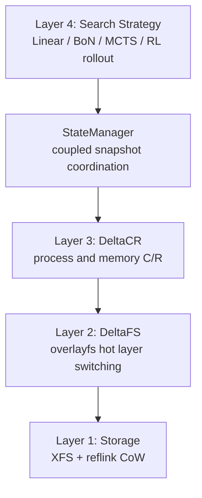
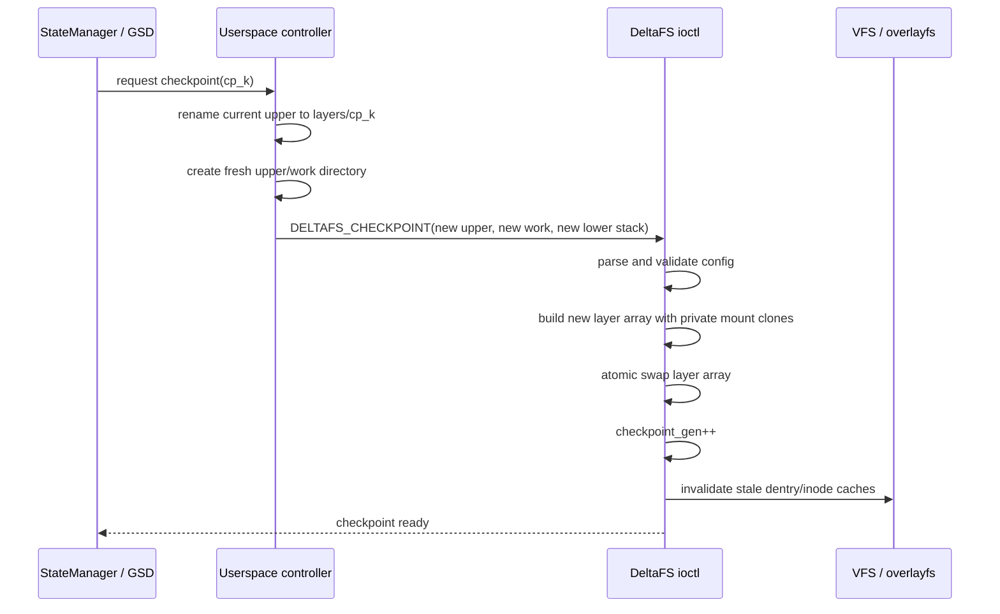
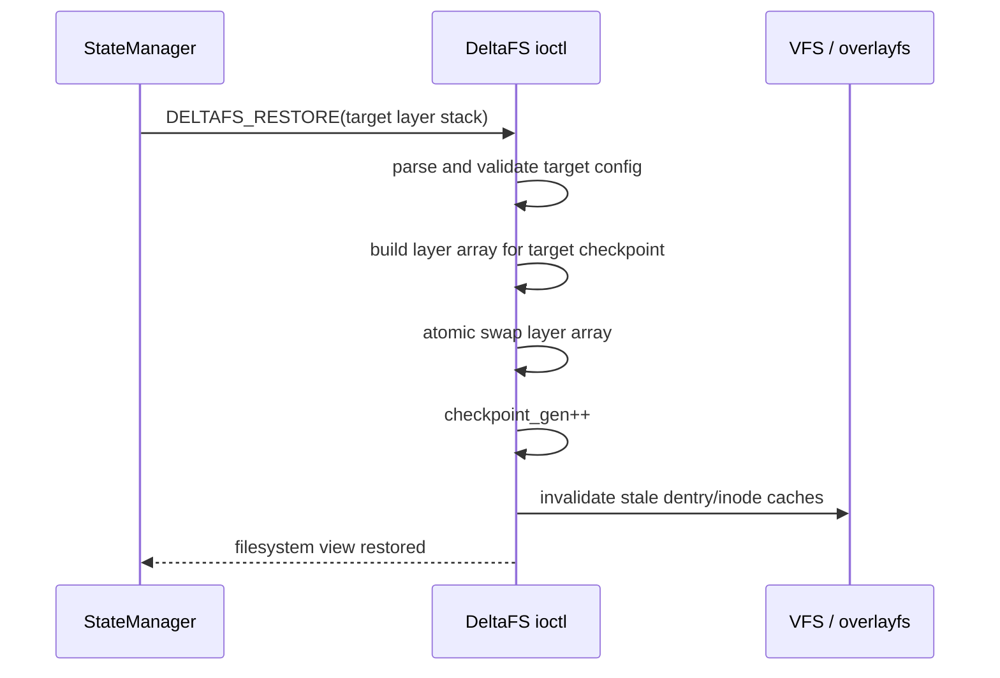

# DeltaFS 设计整理与复现方案

本文基于本地论文 `DeltaBox: Scaling Stateful AI Agents with Millisecond-Level Sandbox Checkpoint/Rollback` 整理，重点关注其中的 DeltaFS 文件系统状态管理机制，并给出复现 DeltaFS 所需的环境、实现路线和验证方案。

## 1. DeltaFS 的目标

DeltaFS 的目标是为有状态 AI Agent 沙箱提供毫秒级、可回滚、可分支的文件系统状态管理。它解决的问题不是普通容器启动慢，而是 Agent 在 MCTS、Best-of-N、RL rollout 等场景中会频繁执行真实 OS 命令，例如编辑代码、安装依赖、运行测试、生成缓存文件，然后需要回到任意历史节点继续探索。

论文给 DeltaFS 设定的核心目标如下：

- 毫秒级 checkpoint/rollback：checkpoint 和 rollback 都要出现在 Agent 执行路径上，不能依赖秒级文件复制、Docker commit 或 VM snapshot。
- 状态增量化：只复制相邻 checkpoint 之间实际变化的文件块，而不是复制整个工作目录。
- 支持任意历史点回滚：回滚到历史 checkpoint 时，文件系统恢复应接近 O(1)，不随目录大小或文件数量线性增长。
- 对 Agent 透明：Agent 不需要重启，不需要重新执行历史命令，也不需要知道底层层栈发生了切换。
- 与进程状态一致：DeltaFS 只负责 durable filesystem state，必须与 DeltaCR 的 memory/process checkpoint 协同，才能得到完整的 `(filesystem, memory)` 一致状态。

DeltaFS 不是一个从零开始写的磁盘文件系统。它是对 Linux overlayfs 的扩展：让 overlayfs 的 layer stack 可以在运行时热切换，而不是只能在 mount 时固定。

## 2. 在 DeltaBox 中的位置

DeltaBox 的整体栈可以理解为四层：



DeltaFS 是 Layer 2。它直接管理 Agent 工作目录的文件视图。底层存储在真实文件系统上，论文原型使用启用 reflink 的 XFS。上层 StateManager 记录每个 checkpoint 对应的 DeltaFS layer 配置，并把 DeltaFS 与 DeltaCR 同步为一个原子状态。

## 3. 核心设计思想

传统 overlayfs 的基本结构是：

- lowerdir：只读基础层，通常来自镜像或初始仓库。
- upperdir：唯一可写层，应用所有新写入和 copy-up 都进入这里。
- workdir：overlayfs 工作目录。
- merged mount：应用看到的合并视图。

传统 overlayfs 的问题是 layer stack 在 mount 时固定。如果要切换 lowerdir/upperdir，通常需要 umount 再 mount。这在 Agent 场景里不可接受，因为 Agent 可能持有打开文件、mmap 区域、当前工作目录、缓存 dentry/inode，而且 checkpoint 频率很高。

DeltaFS 的关键改动是：

- checkpoint 时，不复制工作目录。
- 将当前 writable upper 冻结为新的 read-only lower。
- 插入一个全新的 writable upper。
- 后续写入自然通过 overlayfs copy-on-write 进入新 upper。
- rollback 时，直接把 overlay layer stack 切到目标 checkpoint 对应的层组合。

可以把 DeltaFS 的状态看成如下层栈：

```text
checkpoint 0:
    upper = step-0-rw
    lower = base

checkpoint 1 后:
    upper = step-1-rw
    lower = step-0-ro : base

checkpoint 2 后:
    upper = step-2-rw
    lower = step-1-ro : step-0-ro : base

rollback 到 checkpoint 1:
    upper = step-1-rw-or-new-rw-for-branch
    lower = step-0-ro : base
```

论文图 4 中的例子是：传统 overlayfs 只有一个 RW upper 和一个 RO lower；DeltaFS 在每一步完成后把当前 upper 变成历史层，并在其上插入新的 RW upper。checkpoint 变成“插层”，rollback 变成“切层栈”。

## 4. 数据模型

一个可复现实现至少需要维护这些对象：

### 4.1 Layer 目录

建议每个 Agent sandbox 使用独立的 DeltaFS 根目录：

```text
/var/lib/deltafs/<sandbox-id>/
    base/                     # 初始只读基础层，可来自镜像或仓库
    layers/
        cp-000000/             # checkpoint 0 冻结层
        cp-000001/             # checkpoint 1 冻结层
        cp-000002/
    upper/
        active/                # 当前可写 upper
    work/
        active/                # overlayfs workdir
    meta/
        snapshots.json         # 用户态 StateManager 的索引
```

论文原型中，当前 upper 在 checkpoint 前由用户态 controller rename 成新的只读 lower。这个 rename 很重要：它保留 XFS reflink 的 extent map，不重新物化文件内容。

### 4.2 Snapshot 元数据

StateManager 需要记录每个 checkpoint 的文件系统配置：

```json
{
  "checkpoint_id": "cp-000123",
  "upper": "/var/lib/deltafs/s1/upper/active",
  "work": "/var/lib/deltafs/s1/work/active",
  "lower_stack": [
    "/var/lib/deltafs/s1/layers/cp-000122",
    "/var/lib/deltafs/s1/layers/cp-000121",
    "/var/lib/deltafs/s1/base"
  ],
  "checkpoint_gen": 123
}
```

对于完整 DeltaBox，还要记录 CRIU dump path、template process PID、搜索树父子关系等；但 DeltaFS 本身只需要知道 layer stack 和 generation。

### 4.3 Kernel 内部状态

DeltaFS 在 overlayfs 内部维护：

- 当前 layer array 指针：描述 upper、lower、private mount clone 等。
- per-filesystem `checkpoint_gen`：每次 layer stack 切换递增。
- per-inode generation：该 inode 上次按哪个 generation 解析。
- dentry/inode revalidation 标记：切换后避免缓存返回旧 upper。
- 延迟释放队列：旧 layer array 不能立刻释放，要等 in-flight reader 安全退出。

论文实现提到 checkpoint ioctl 约 565 行 C，分布在 Linux 6.8 overlayfs 的 4 个文件中。layer-array pointer 在 spinlock 下原子交换，旧数组在 RCU grace period 后释放，cached dentries 会被标记为需要 revalidation。

## 5. Checkpoint 流程

DeltaFS checkpoint 是同步 ioctl，但关键路径只做元数据操作。

推荐实现流程：



更细节地说：

1. Agent 到达一个可 checkpoint 的时刻。完整 DeltaBox 中，DeltaCR 使用 CRIU 短暂 SIGSTOP Agent；DeltaFS ioctl 与 CRIU dump 观察同一个静止瞬间。
2. 用户态 controller 把当前 upper 通过 `rename(2)` 改名为历史层，例如 `layers/cp-000123`。
3. 用户态创建新的 `upper/active` 和 `work/active`。
4. controller 调用 DeltaFS 自定义 ioctl，传入新的 upper、work、lower stack。
5. 内核解析配置，为每个路径创建 private mount clone，构造新的 layer array。
6. 在锁保护下发布新的 layer array，并递增 `checkpoint_gen`。
7. 标记旧 dentry/inode 缓存需要重新校验。
8. 旧 layer array 延迟释放，避免并发读路径悬空。

checkpoint 之后，旧 upper 已经成为 read-only lower，代表 checkpoint 之前的文件修改。新的写入都进入 fresh upper。

## 6. Rollback / Restore 流程

DeltaFS restore 是把 layer stack 切回目标 checkpoint 的配置。

DeltaFS 视角的流程：



回滚到历史 checkpoint 时，目标层栈不包含该 checkpoint 之后的 upper/lower，因此后续修改自然被丢弃。相比 `copytree` 或 git branch/stash，恢复不需要遍历所有文件。

论文报告的 DeltaBox 整体 weighted average 是：

- checkpoint 本地工作约 10.83 ms，但被 LLM inference 窗口隐藏，Agent 感知阻塞为 0。
- fast-path restore 约 1.86 ms。
- DeltaFS overlay ioctl 本身更小：checkpoint 约 0.07 ms，fast restore 约 0.19 ms，slow restore 约 0.25 ms。


## 7. Lazy Switch: 打开文件和 mmap 的处理

仅仅切换 layer array 不够。困难点在于：checkpoint 前已经打开的文件、mmap 区域或缓存 inode 可能仍然持有旧 upper dentry 指针。切换后，如果继续写这些旧对象，可能污染已经冻结的历史层。

DeltaFS 的解决方案是 generation-based lazy switch：

- 文件系统全局维护 `checkpoint_gen`。
- 每个 overlay inode 记录自己上次解析时的 generation。
- 写路径检查 inode generation 是否等于当前 filesystem generation。
- 如果相等，说明 inode 指向当前层栈，可以走 fast path。
- 如果不相等，说明这个 inode 是跨 checkpoint 遗留对象，进入 slow path：
  - 按新 layer stack 重新解析该路径。
  - 必要时 copy-up 到当前 upper。
  - 在 per-inode mutex 下原子更新 backing dentry 和 inode generation。

并发 copy-up 的 race 也要处理。论文描述的策略是：

- 如果两个线程同时 copy-up 同一个 dentry，失败者可能看到 `EEXIST`。
- DeltaFS 比较已有 upper 的 backing mount 是否等于当前 overlay upper。
- 如果是同 generation 的 upper，就复用。
- 如果是 checkpoint 前的 stale upper，就丢弃并重新解析。

这个机制让打开文件跨 checkpoint 后仍能透明写入当前分支，而不会破坏已冻结 checkpoint。

需要特别测试的场景：

- `open()` 后 checkpoint，再通过旧 fd 写入。
- `mmap(MAP_SHARED)` 后 checkpoint，再写入映射区域。
- checkpoint 后 rename、unlink、chmod、truncate。
- 多线程同时写同一文件触发 copy-up。
- dentry cache 命中旧对象后是否强制 revalidate。

## 8. XFS reflink 与写放大控制

DeltaFS 可以运行在任意 backing filesystem 上，但论文原型使用启用 reflink 的 XFS，这是达到低写放大的关键。

普通 overlayfs copy-up 在修改 lower 文件时，往往会把整个文件复制到 upper。如果一个大文件只修改 1 KB，也可能复制整个文件，写放大和文件大小相关。

在 XFS reflink 上：

- overlayfs copy-up 使用 `vfs_clone_file_range`。
- XFS 创建共享 extent 引用，而不是立即复制数据块。
- 未修改 extent 在多个 checkpoint 层之间共享同一个物理块。
- 真正写入时才按块 CoW，论文以 4 KB 粒度描述。
- checkpoint 时通过 `rename(2)` demote upper，保留 extent map 和 reflink 关系。
- reflink 可传递组合：一个 extent 如果跨 N 个 checkpoint 都没被修改，只占用一份物理块。

这避免了每个 checkpoint 重新物化历史层。论文评估显示，ext4 和未启用 reflink 的 XFS 在 copy-up 数据量上基本重合，都会随文件大小增长；XFS+reflink 曲线低且平，真实 Agent 小编辑只复制少量块。


## 10. 复现环境

### 10.1 最小 DeltaFS 复现环境

用于复现 DeltaFS 的 layer hot-switch、lazy switch、XFS reflink 写放大优化。

硬件建议：

- x86_64 Linux 机器或支持 KVM 的云主机。
- 4 核以上 CPU，16 GB 以上内存。
- NVMe SSD 或本地 SSD，建议 100 GB 以上空闲空间。
- root 权限或可加载自定义内核模块的环境。

软件建议：

- Linux kernel 6.8 源码。
- GCC/Clang 内核编译工具链。
- `make`, `bc`, `bison`, `flex`, `libssl-dev`, `libelf-dev`, `dwarves`。
- `xfsprogs`，用于创建和检查 XFS reflink 文件系统。
- `fio`, `filefrag`, `xfs_io`, `du`, `perf`, `strace`，用于评估和调试。
- Python 3，用于编写用户态 controller 和 benchmark。

存储要求：

- backing filesystem 使用 XFS，并启用 reflink。
- 可以通过 loopback image 创建独立 XFS：

```bash
truncate -s 40G deltafs-xfs.img
mkfs.xfs -m reflink=1 deltafs-xfs.img
mkdir -p /mnt/deltafs-xfs
mount -o loop deltafs-xfs.img /mnt/deltafs-xfs
```

注意：较新 XFS 默认通常启用 reflink，但复现实验应显式检查。

## 11. 技术实现方案

### 11.1 内核侧：扩展 overlayfs

建议从 Linux 6.8 overlayfs 开始修改，核心任务如下：

1. 增加 DeltaFS ioctl 入口
   - `DELTAFS_CHECKPOINT`
   - `DELTAFS_RESTORE`
   - 可选：`DELTAFS_GET_STATE`
   - 可选：`DELTAFS_DROP_LAYERS` 或 GC 辅助接口

2. 定义 ioctl 参数结构

```c
#define DELTAFS_MAX_LAYERS 512
#define DELTAFS_PATH_MAX   4096

struct deltafs_layer_config {
    __u32 nr_lower;
    char upper[DELTAFS_PATH_MAX];
    char work[DELTAFS_PATH_MAX];
    char lower[DELTAFS_MAX_LAYERS][DELTAFS_PATH_MAX];
    __u64 expected_gen;
    __u64 new_gen;
};
```

真实实现应避免超大 ioctl struct，可改用用户指针数组或 netlink/configfs。这里仅表达接口语义。

3. 支持运行时 layer array 构建
   - 解析用户传入路径。
   - 对每个路径创建 private mount clone。
   - 验证 upper/work/lower 的权限和文件系统兼容性。
   - 构造新的 overlay layer array。

4. 原子发布新 layer array
   - spinlock 或 seqlock 保护发布。
   - 使用 release-consistent store 发布新指针。
   - 递增 `checkpoint_gen`。
   - 标记 dentry/inode cache stale。
   - 旧 array 放入 RCU 延迟释放队列。

5. 修改 write path 支持 lazy switch
   - 在写入、truncate、setattr、mmap writeback 等路径检查 inode generation。
   - mismatch 时重新 resolve 当前 layer stack。
   - 必要时 copy-up 到当前 upper。
   - per-inode mutex 保护 backing dentry 更新。

6. 处理 copy-up race
   - 对 `EEXIST` 做二次检查。
   - 比较 backing mount identity。
   - 同 generation upper 复用。
   - stale upper 丢弃并重试。

7. 保证 whiteout 和 opaque dir 语义
   - unlink、rmdir、rename 后的 overlayfs whiteout 必须随 checkpoint layer 一起冻结。
   - restore 到旧 layer stack 后，后续分支的 whiteout 不应影响旧 checkpoint。

### 11.2 用户态 controller

用户态负责准备目录、维护 snapshot metadata、调用 ioctl。

建议组件：

```text
deltafsctl/
    mount                 # 初始化 sandbox
    checkpoint <id>       # 冻结 active upper，插入 fresh upper
    restore <id>          # 切回目标 layer stack
    list                  # 查看 checkpoint
    gc                    # 删除不可达历史层
```

checkpoint 伪代码：

```python
def checkpoint(cp_id):
    old_upper = root / "upper" / "active"
    old_work = root / "work" / "active"
    frozen = root / "layers" / cp_id

    os.rename(old_upper, frozen)
    os.makedirs(old_upper)
    recreate_empty_workdir(old_work)

    lower_stack.insert(0, frozen)

    ioctl_deltafs_checkpoint(
        mount_fd=merged_fd,
        upper=old_upper,
        work=old_work,
        lower=lower_stack,
        expected_gen=current_gen,
    )

    snapshots[cp_id] = {
        "lower_stack": list(lower_stack),
        "gen": current_gen + 1,
    }
```

restore 伪代码：

```python
def restore(cp_id):
    target = snapshots[cp_id]

    ioctl_deltafs_restore(
        mount_fd=merged_fd,
        upper=current_branch_upper(cp_id),
        work=current_branch_work(cp_id),
        lower=target["lower_stack"],
        expected_gen=current_gen,
    )

    current_gen += 1
```

分支搜索场景中，restore 后通常需要为新分支准备 fresh upper，避免写入污染目标 checkpoint 的 frozen layer。

### 11.3 XFS reflink 验证

需要确认 copy-up 没有复制整个文件。可使用：

```bash
xfs_io -c "reflink source_file 0 target_file 0 1M" target_file
filefrag -v source_file target_file
du -B1 source_file target_file
```

在 DeltaFS 中应设计 benchmark：

1. base 层放一个 256 MB 文件。
2. checkpoint。
3. 修改 merged 视图中的 4 KB。
4. checkpoint。
5. 用 `du`、loop device sector 计数、`filefrag` 检查物理写入和 extent sharing。

对比三种 backing：

- ext4。
- XFS without reflink。
- XFS with reflink。

预期：只有 XFS with reflink 能让 copy-up 数据量接近实际修改块数，而不是文件大小。

## 12. 验证计划

### 12.1 功能正确性

必须覆盖：

- 创建文件后 checkpoint，继续修改，再 restore，文件内容回到 checkpoint。
- 删除文件后 checkpoint，再 restore 到删除前，文件恢复。
- restore 到删除后，whiteout 生效。
- rename 目录和文件跨 checkpoint 后语义正确。
- chmod/chown/utime/xattr 跨 checkpoint 正确。
- symlink、hardlink、目录 opaque 标记正确。
- 多 checkpoint 链回滚到任意历史点。
- 从历史点恢复后创建新分支，两个分支互不污染。

### 12.2 打开文件和 mmap

重点覆盖 lazy switch：

```c
int fd = open("a.txt", O_RDWR);
write(fd, "before", 6);
checkpoint();
write(fd, "after", 5);
restore(checkpoint_before_after);
```

预期：

- checkpoint 前的 frozen layer 不被旧 fd 后续写入污染。
- 旧 fd 写入触发 re-resolve/copy-up，进入当前 active upper。
- restore 后看到目标 checkpoint 的内容。

mmap 测试：

- `mmap(MAP_SHARED)` 后 checkpoint。
- 通过内存写入。
- `msync`。
- 验证写入进入当前 generation 的 upper，而非 frozen layer。

### 12.3 并发与缓存

- 多线程同时写同一 lower 文件，触发并发 copy-up。
- checkpoint/restore 与大量 `stat/open/read/write` 并发。
- restore 后立即 `ls/stat/open`，确认没有旧 dentry cache。
- 使用 `fsstress` 或 xfstests 子集做压力测试。

### 12.4 性能指标

建议记录：

- checkpoint ioctl latency。
- restore ioctl latency。
- active upper 插入的总耗时。
- copy-up duplicated bytes。
- physical I/O bytes。
- dentry/inode revalidation 次数。
- lazy switch slow-path 次数。
- layer 数量增长时的读写开销。

论文参考值：

- DeltaFS overlay ioctl checkpoint 约 0.07 ms。
- DeltaFS overlay ioctl fast restore 约 0.19 ms。
- DeltaFS overlay ioctl slow restore 约 0.25 ms。

复现时不必一开始达到这些数值，但应先证明：

1. checkpoint/restore 与文件数量无关。
2. restore 不需要遍历工作目录。
3. XFS reflink 让写放大接近实际修改块数。

## 13. 关键风险与实现难点

- overlayfs 内部结构不是稳定 ABI，Linux 版本漂移会影响补丁。
- dentry/inode cache 失效很容易漏路径，尤其是 open fd、cwd、mmap、rename、hardlink。
- lock ordering 必须谨慎，避免 VFS path walk、copy-up、inode mutex、overlayfs locks 之间死锁。
- RCU 生命周期必须正确，否则 layer array hot-swap 会产生 use-after-free。
- whiteout/opaque dir 是 overlayfs rollback 正确性的核心，不能只测试普通文件写入。
- reflink 只解决文件数据块写放大，不等于零元数据开销。
